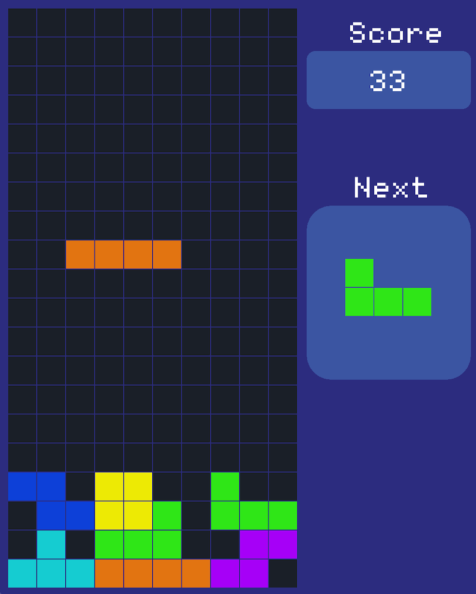
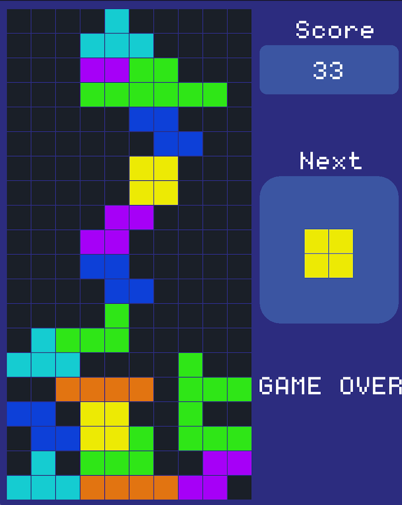

# 🎮 Tetris Game

A classic **Tetris clone** developed in **C++** using the **Raylib graphics library**. Built with object-oriented principles, clean game loop architecture, and smooth gameplay.

---

## 🚀 Features

- ✅ Classic Tetris mechanics  
- 🎨 Raylib-based visual rendering  
- 🎮 Smooth block movement & rotation  
- 🧠 OOP architecture for maintainability  
- 📦 Released and playable version

---

## 🎮 How to Play

| Action           | Key               |
|------------------|-------------------|
| Move Left/Right  | ← / → arrow keys  |
| Soft Drop        | ↓ arrow key       |
| Hard Drop        | Spacebar          |
| Rotate Block     | Z / X             |
| Quit             | ESC               |

---

## 📥 Play Now

### 🔗 [Download Latest Release](https://github.com/harshitrajora/Tetris-Game/releases)

> Pre-built executable for Windows/Mac/Linux available in Releases.

---


## 🛠️ Build from Source

> Requirements: C++ Compiler, Raylib installed




### 🔧 Steps:
```bash
# 1. Clone the repository
git clone https://github.com/harshitrajora/Tetris-Game.git
cd Tetris-Game

# 2. Install raylib (only needed once)
brew install raylib

# 3. Compile the game (make sure you're in the project root)
g++ src/*.cpp -o Tetris -std=c++17 \
  -I/opt/homebrew/include \
  -L/opt/homebrew/lib \
  -lraylib -framework OpenGL -framework Cocoa -framework IOKit -framework CoreAudio

# 4. Run the game
./Tetris


